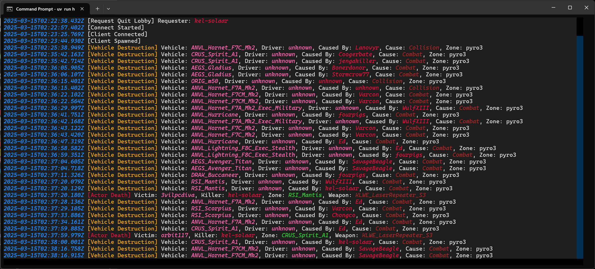

# Star Citizen Log Monitor

An opinionated log monitor for [Star Citizen](https://robertsspaceindustries.com/)
with an emphasis put on extracting combat related data.



## Usage

Review the script! Never execute directly a script from an untrusted source
without having verified its content prior!

Assuming that [Astral'uv](https://docs.astral.sh/uv/getting-started/installation/) is installed:

```shell
uv run https://raw.githubusercontent.com/KelSolaar/star-citizen-log-monitor/refs/heads/master/star_citizen_log_monitor.py
```

Use `CTRL + Q` to quit.

It is possible to read a specific log file by passing its path as follows:

```shell
uv run https://raw.githubusercontent.com/KelSolaar/star-citizen-log-monitor/refs/heads/master/star_citizen_log_monitor.py --log-file-path "C:\Path\To\Game.log"
```

## About

**Star Citizen Log Monitor** by Thomas Mansencal

Copyright 2025 Thomas Mansencal

This software is released under terms of BSD-3-Clause: https://opensource.org/licenses/BSD-3-Clause
